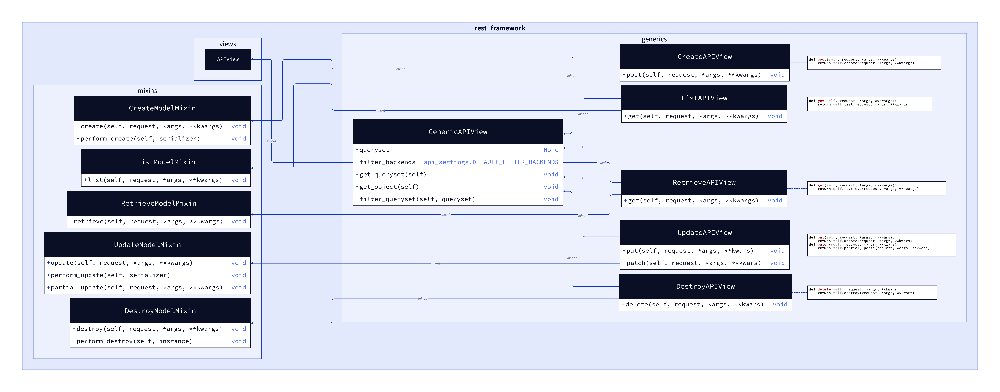

# django2_uml_diagrams

## Render diagrams

```bash
for file in $(ls ./d2/); do d2 -l elk ./d2/"${file}" ./diagrams/"$(basename "${file}" .d2)".png; done
```

## Prepare links to diagrams for README.md

```bash
for file in $(ls ./diagrams/); do echo ''; done
```

---


